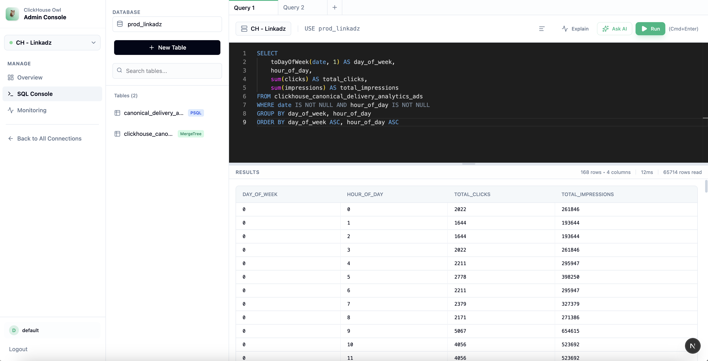

# ClickHouse Owl 🦉



Modern, AI-powered admin management interface for ClickHouse databases.

## Overview

ClickHouse Owl is a beautiful, modern web-based admin interface for managing ClickHouse databases. It provides an intuitive UI for executing queries, managing databases and tables, and monitoring system activity.

## Features

- **📊 Dashboard** - Real-time overview of databases, tables, and system status
- **⚡ Smart SQL Editor**
    - **Tabbed Interface** - Work on multiple queries simultaneously
    - **AI-Powered** - Generate queries using natural language (supports OpenAI, Gemini, Claude)
    - **Run Selected** - Execute only highlighted text
    - **Execution Plan** - Visualize query performance with EXPLAIN PLAN
- **💾 Database Management** - Create, manage, and inspect schemas
- **📋 Table Management**
    - **Visual Creator** - Design tables with a UI builder
    - **Import/Link** - Create tables from external datasources (PostgreSQL, MySQL, S3)
    - **Data Preview** - Inspect table data with sorting and filtering
    - **Truncate/Drop** - Safe management with confirmation dialogs
- **🔌 Multi-Connection** - Manage multiple ClickHouse server connections
- **🎨 Modern UI** - Clean, responsive interface with dark mode support

## Tech Stack

- **Framework**: Next.js 14 (App Router)
- **Language**: TypeScript
- **Styling**: Tailwind CSS
- **Editor**: Monaco Editor (VS Code core)
- **Icons**: Lucide React
- **AI Integration**: Vercel AI SDK

## Getting Started

### Prerequisites

- Node.js 18+
- A running ClickHouse server

### Installation

```bash
# Clone the repository
git clone <repository-url>
cd clickhouse-owl

# Install dependencies
npm install

# Start the development server
npm run dev
```

The application will be available at `http://localhost:3000`

### Build for Production

```bash
npm run build
npm start
```

## Configuration

### API Endpoint

The application uses Next.js API Routes for backend proxying to ClickHouse.
- `/api/query` - Execute SQL queries
- `/api/ai/generate` - AI query generation

### AI Configuration

To enable AI features, set the following keys in your local storage or environment variables (feature specific setup guide coming soon):
- `openai_api_key`
- `gemini_api_key`
- `claude_api_key`

## Usage

1. **Connect** - Add a connection to your ClickHouse server
2. **Explore** - Browse databases and tables in the sidebar
3. **Query** - Use the SQL Editor with tabs and AI assistance
4. **Manage** - Right-click tables or use the toolbar to create, duplicate, rename, or drop tables

## License

MIT

## Acknowledgments

Built with modern web technologies and designed for the ClickHouse ecosystem.
